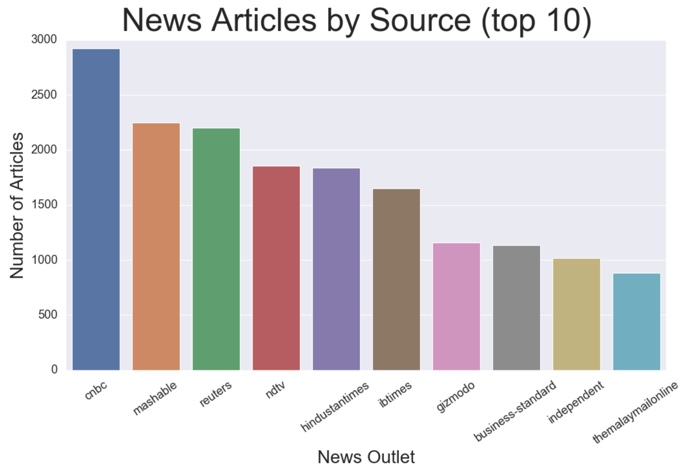
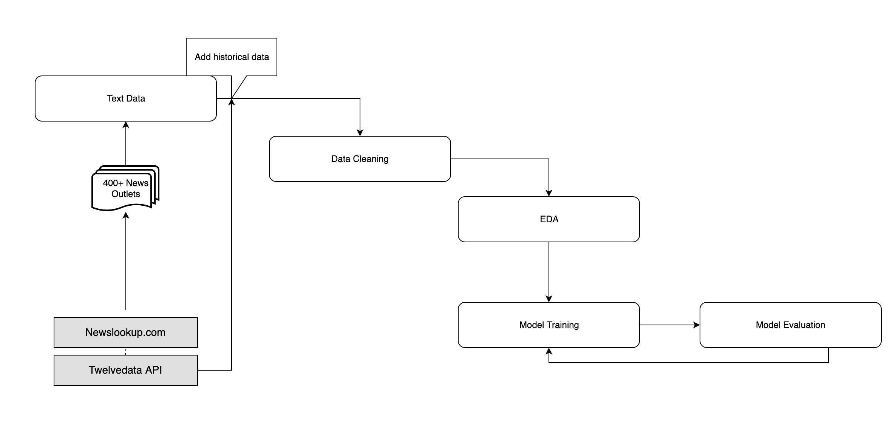
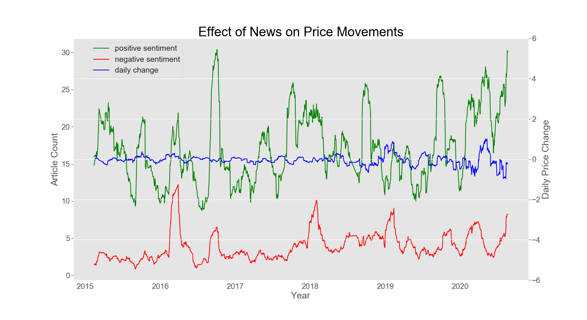
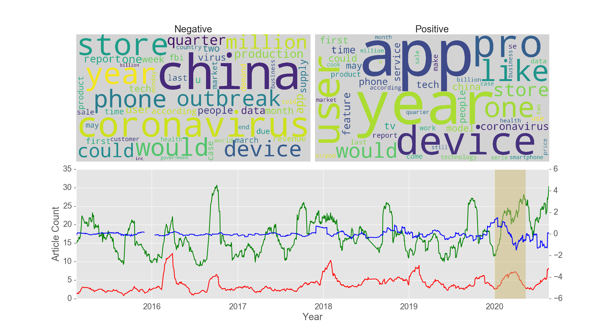
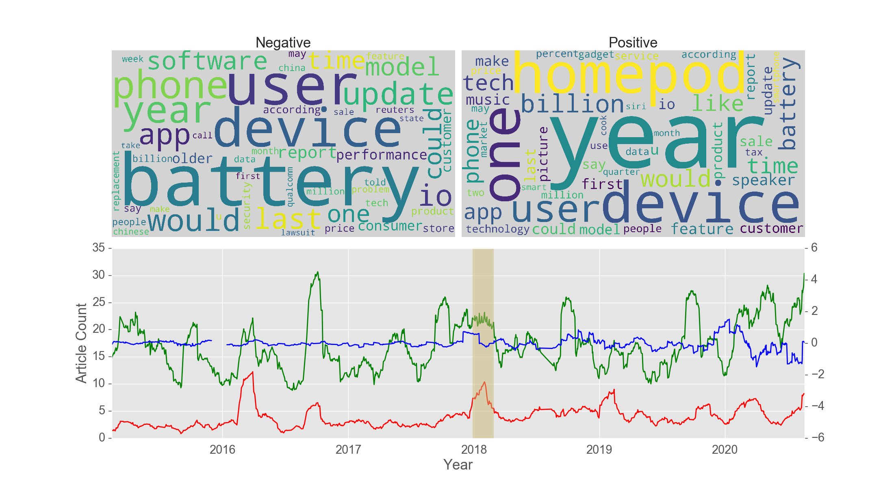
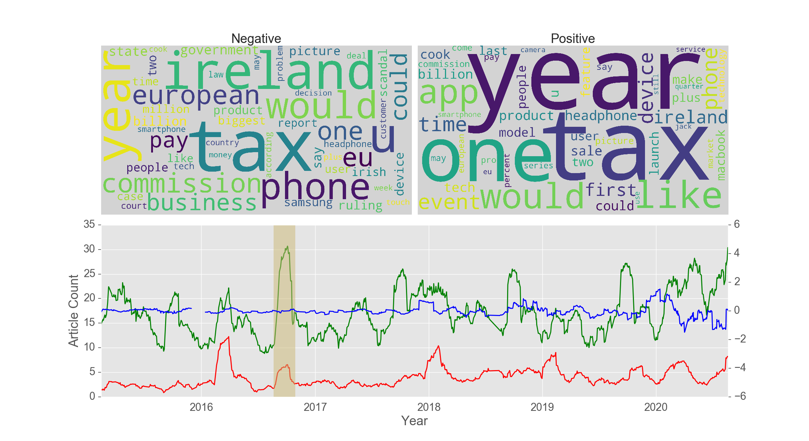
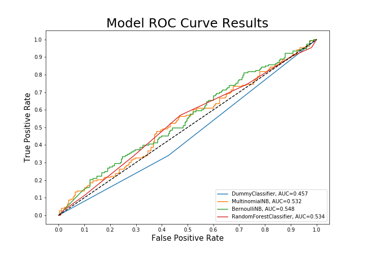

# Trading on Sentiment.
#### First steps towards classifying market movements across the DOW Industrial Average with text mining.

 

**Author:** [Brendan Ferris](https://www.linkedin.com/in/brendangferris/)

## Overview

Historically two routes to predicting market movements have been utilized. The first route is technical analysis, which primarily focuses on the use of quantitative stock indicators in order to predict fluctuations. The second most popular route is fundamental analysis, which takes qualitative information like news and behavioral economics into consideration. By focusing on the sentiment of news related to a given company, we employ the latter method in this project. 

## Business Problem

Predicting stock price movements is a historically difficult task. A large asset management firm has contracted me to train a classifier to predict the short term (24 hour) price movements of Apple, with later plans to apply what I learned in order to predict movements of the entire Dow Jones Industrial Index. Predictions made by the model will be used as a supplemental tool to guide decision making on behalf of the firms clients. According to the [Efficient Market Hypothesis (EMH)](https://www.sciencedirect.com/topics/economics-econometrics-and-finance/efficient-market-hypothesis), financial assets are priced fairly in developed markets -- making it impossible to gain an 'edge' with any measure of consistency over time. According to this theory the only way for a normal investor to make large gains would be to either adopt a passive investment strategy or make riskier investments on smaller companies. 

## Data

Article links and publish dates were obtained by scraping [Newslookup](https://www.newslookup.com/) in tandem with the [Newspaper3k](https://newspaper.readthedocs.io/en/latest/) package, which enables a streamlined method to scrape fulltext articles from various news sources. Each article is indexed on the date it was published. In total, 39,000 fulltext news articles from 448 sources were obtained.

## Methods

In order to complete this task, three primary objectives must be met. First, a data pipeline must be established which allows for a variety of past and present news sources to be scraped. Second, the data must be cleaned and processed in a machine-readable format. Third, the classifier needs to be trained on the cleaned data.

## Results

After aggregating all of the article text to one row per day, and performing analysis on the 30 day rolling mean, we are able to visualize the impact (or lack thereof) that news and sentiment have on stock price movements. 

From the graph above, we can see that there are a few interesting regions that can be explored. First, the period between January 2020 and March 2020 increase in negative news, which is also reflected by the drop in daily returns. By isolating the articles written over this time period, we can see that the negative press alludes to fears about apple supply chain in China, while positive press was focused more on the brand itself and users.

Wordclouds of the news articles of both positive and negative sentiment articles from the beginning of 2018 show that returns were negatively affected by two major scandals. Apple was accused of throttling phone speeds on older phones, leading to government probes in europe discussing [planned obscelesence](https://en.wikipedia.org/wiki/Planned_obsolescence). Additionally, iPhone users began to report that their phones batteries were exploding, which led Apple to announce [they would replace](https://support.apple.com/iphone/repair/service/battery-power) batteries on phones that may have the defect. During this period, Apple also released the HomePod, to mixed reviews. We can see that in this case, investors acted on the news of recalls and possible government intervention. 

Late 2016 brought news of Apple parking shielding corporate profits in ireland, through as scheme known as the ['Double Irish'](https://en.wikipedia.org/wiki/Double_Irish_arrangement). Despite being [ordered to pay](https://www.dw.com/en/juncker-says-apple-ruling-not-meant-to-attack-the-usa/a-19525846) billions in fines, stock prices were not effected. In fact, it seems that the dominant sentiment was positive during this period, with only a slight negative bump.

## Conclusions

Throughout the course of this project my hypothesis was that news articles would be a good indicator of stock direction. It seems logical, that investors may act on both good and bad media coverage. However, this relationship is much more subtle than I expected. In the future, to increase the accuracy of predictions I will incorporate social media and forum data. We have seen that there are controversies and scandals that have and impact on short-term price direction, but at the same time other events have no effect on price, such as the 'Double Irish' scandal and subsequent fines. In that situation, even though Apple was being fined billions, short term price movements were steady. As I expand this project into the other stocks that comprise the DOW, It will be interesting to see how different news effects different companies. Through this analysis I concluded that a Bernoulli Naive Bayes increased F1 scores by 11%. Additionally, Bernoulli Naive Bayes provided a 9% increase from the baseline. Further gains should be expected as more features and data are added.

## Next Steps

Going forward, I plan on expanding the scope of this project to include all of the 30 stocks which comprise the DOW. My hypothesis would be that news relating to each stock varies, making it difficult to accurately predict any one stock consistantly, however; many weak classifiers may produce good prediction overall. Some thoughts on how to improve prediction power include:

1) For this project, i'm focusing on a time window of 24 hours to classify the direction of change. Further analysis into different time windows may show different results. 

2) Adding word embeddings may improve the overall accuracy of predictions. 

3) Developing a data pipline suitable for online learning would allow the classifier to update as news breaks.

4) Including social media data/Corporate business filings may benefit the prediction power of the model. 

## For More Information

The full analysis notebook can be found [here](modeling_notebook.ipynb), or review the [slide deck](slide_deck.pdf).

## Repository Structure

<pre>
├── EDA_notebook-complete.ipynb
├── README.md
├── custom_scripts.py
├── data_cleaning.ipynb
├── images
│   ├── banner_image.jpg
│   ├── early_2018_article_analysis.png
│   ├── early_2020_article_analysis.png
│   ├── effect_of_news_on_price.png
│   ├── late_2016_article_analysis.png
│   ├── model_analysis.png
│   ├── news_articles_by_source.png
│   └── workflow_diagram.png
├── main_data
│   ├── maindf.pkl
│   └── seperated_data.pkl
├── modeling_notebook.ipynb
├── news_lookup.ipynb
├── slide_deck.pdf
├── the_data.ipynb
├── yearly_actuals
│   └── actuals.csv
└── yearly_articles
    ├── apple2015.csv
    ├── apple2016.csv
    ├── apple2017.csv
    ├── apple2018.csv
    ├── apple2019.csv
    └── apple2020.csv
</pre>

#### Sources:

***[Text mining for market prediction: A systematic review](https://www.sciencedirect.com/science/article/abs/pii/S0957417414003455?via%3Dihub)***

***[Predicting Stock Price Falls Using News Data: Evidence from the Brazilian Market](https://pubmed.ncbi.nlm.nih.gov/33223615/)***

***[Stock Predictions through News Sentiment Analysis](https://software.intel.com/content/www/us/en/develop/blogs/stock-predictions-through-news-sentiment-analysis.html)***

***[Stock  Price  Prediction  Using  News  Sentiment  Analysis](http://davidanastasiu.net/pdf/papers/2019-MohanMSVA-BDS-stock.pdf)***
